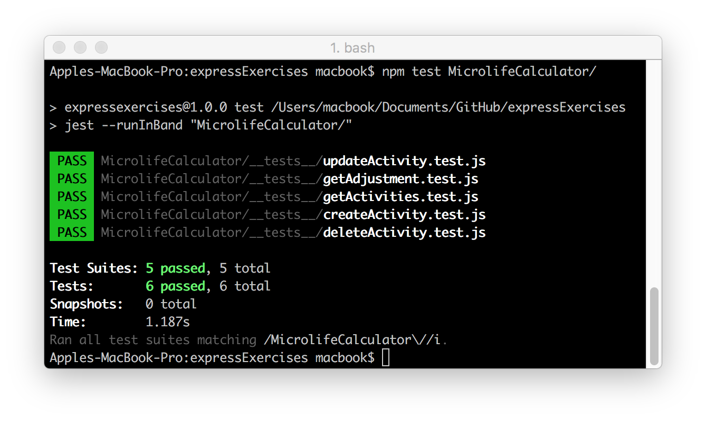

## Microlife Calculator
Building a life activity tracker, which will tell us how much our life expectancy has increased or decreased based on a day's activities. Use a single JSON file to store information about the user and their activities. Application will be developed with a Test-Driven approach.

### Built with
* [npm](https://www.npmjs.com/) - Node Package Manager
* [Jest](https://facebook.github.io/jest/) - JavaScript Testing Framework
* [Express](https://expressjs.com/) - Server-side JavaScript Framework
* [Postman](https://www.getpostman.com/) - Tool for Testing API
* [uuid](https://www.npmjs.com/package/uuid) - Generate universally unique identifier (UUID)

